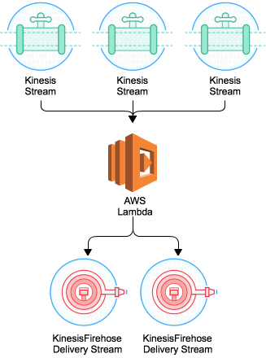

# AWS Streams to Kinesis Firehose Forwarder

__Please note that this project is now deprecated for Kinesis Streams sources. For forwarding Kinesis Streams data to Kinesis Firehose, you can now configured Kinesis Streams as a source directly. You may still find this project useful for forwarding DynamoDB Update Streams to Kinesis Firehose__

Amazon Kinesis Firehose simplifies delivery of streaming data to Amazon S3 and Amazon Redshift with a simple, automatically scaled, and zero operations requirement. Where customers have existing systems built on streaming interfaces, the addition of Firehose can enable simple archive, or be used to facilitate long term analysis of data from Amazon Redshift. Integration can be accomplished by using the [Kinesis Agent](http://docs.aws.amazon.com/firehose/latest/dev/writing-with-agents.html) to automatically publish file data to Amazon Kinesis Streams and/or Amazon Kinesis Firehose delivery streams. This project includes an AWS Lambda function that enables customers who are already using Amazon Kinesis Streams for real time processing to take advantage of Amazon Kinesis Firehose. Furthermore, if you are using Amazon DynamoDB and would like to store a history of changes made to the table, this function can push events to Amazon Kinesis Firehose.




# Pre-requisites

In order to effectively use this function, you should already have configured an Amazon Kinesis Stream or an Amazon DynamoDB Table with Update Streams, as well as an Amazon Kinesis Firehose Delivery Stream of the correct name. For Amazon Kinesis Streams, please ensure that producer applications can write to the Stream, and that the Amazon Kinesis Firehose Delivery Stream is able to deliver data to Amazon S3 or Amazon Redshift. This function makes no changes to Stream or Firehose configurations. You must also have the AWS Command Line Interface (https://aws.amazon.com/cli) installed to take advantage of the Stream Tagging utility supplied.

# Usage

1. Clone the repository
2. Run build.sh
3. Upload a zip file from the dist directory to your lambda

# Configuration

This Lambda functions can map stream sources to Kinesis Firehose Delivery Streams in a few different ways (listed in order of preference):
* Manually specified configuration (see `deliveryStreamMapping` in [index.js:78](index.js#L78))
* A DynamoDB stream naming convention to determine which Delivery Stream to forward to
* An Kinesis Stream Tagging convention
* (Optionally) A default delivery stream.

## Using the Default Delivery Stream
In order to make sure that data will always be accepted by a Kinesis Firehose Delivery Stream this Lambda function can fail back to a default Delivery Stream if no manual configuration or other lookup has results.

This can be particularly helpful when developing and testing the integration of new data sources. In such cases you could have use the Default Delivery Stream to forward data to an S3 bucket with a one day retention period as specified in an [S3 Lifecycle Policy](http://docs.aws.amazon.com/AmazonS3/latest/dev/object-lifecycle-mgmt.html).

The Default Delivery Stream is enabled by default in the Lambda function, however to use it there should be a Kinesis Firehose with a matching name. You can use the [createDefaultDeliveryStream.sh](createDefaultDeliveryStream.sh) script to orchestrate its creation.

*Note: We recommend the usage of default delivery streams only for non-production workloads. They can be disabled by setting ```USE_DEFAULT_DELIVERY_STREAMS = false``` (see [index.js:70](index.js#L70))*

## Specifying a Delivery Stream for a Kinesis Stream Source
If Amazon Kinesis Streams are the source, the Delivery Stream can be specified in configuration or tags can be used to specify the Delivery Stream target. To Tag the Stream for Amazon Kinesis Firehose Delivery simply run the ```tagKinesisStream.sh``` script:

```
tagStream.sh <My Kinesis Stream> <My Firehose Delivery Stream> <region>
where
	<My Kinesis Stream> - The Amazon Kinesis Stream for which an event source has been created to the Forwarder Lambda function
	<My Firehose Delivery Stream> - The Amazon Kinesis Firehose Delivery Stream which you've configured to deliver to the required destination
	<region> - The region in which the Kinesis Stream & Firehose Delivery Stream have been created. Today only single region operation is permitted
```

This will add a new Stream Tag named ```ForwardToFirehoseStream``` on the Kinesis Stream with the value you supply. This is limited to delivery in the same region as the Kinesis Stream or DynamoDB table. You can run the script any time to update this value. To view the Tags configured on the Stream, simply run ```aws kinesis list-tags-for-stream --stream-name <My Kinesis Stream> --region <region>```

## Specifying a Delivery Stream for a DynamoDB Stream Source
If you are using Amazon DynamoDB, then manual configuration can be used or the Firehose Delivery Stream should have the same name as the Amazon DynamoDB Table.

# Deploying

To use this function, simply deploy the [LambdaStreamToFirehose-1.4.0.zip](https://github.com/awslabs/lambda-streams-to-firehose/blob/master/dist/LambdaStreamToFirehose-1.4.0.zip) to AWS Lambda with handler `index.handler`. You must ensure that it is deployed with an invocation role that includes the ability to write Amazon CloudWatch Logs, Read from Amazon Kinesis or Amazon DynamoDB Streams, and Write to Amazon Kinesis Firehose:

```
{
  "Statement": [
    {
      "Action": [
        "logs:*"
      ],
      "Effect": "Allow",
      "Resource": [
        "*"
      ],
      "Sid": "Stmt1446202596000"
    },
    {
      "Action": [
        "kinesis:DescribeStream",
        "kinesis:ListStreams",
        "kinesis:GetShardIterator",
        "kinesis:GetRecords",
        "kinesis:ListTagsForStream"
      ],
      "Effect": "Allow",
      "Resource": [
        "*"
      ],
      "Sid": "Stmt1446202612000"
    },
    {
      "Action": [
        "firehose:DescribeDeliveryStream",
        "firehose:ListDeliveryStreams",
        "firehose:PutRecord",
        "firehose:PutRecordBatch"
      ],
      "Effect": "Allow",
      "Resource": [
        "*"
      ],
      "Sid": "Stmt1446202630000"
    },
    {
      "Action": [
        "dynamodb:DescribeStream",
        "dynamodb:DescribeTable",
        "dynamodb:GetItem",
        "dynamodb:GetRecords",
        "dynamodb:GetShardIterator",
        "dynamodb:ListStreams",
        "dynamodb:ListTables"
      ],
      "Effect": "Allow",
      "Resource": [
        "*"
      ],
      "Sid": "Stmt1447079825000"
    }
  ],
  "Version": "myversion"
}
```

You may choose to restrict the IAM role to be specific to a subset of Kinesis or DynamoDB Update Streams and Firehose endpoints.

Finally, create an Event Source (http://docs.aws.amazon.com/lambda/latest/dg/lambda-introduction.html) for this function from the Stream to be forwarded to Firehose.

# Optional Data Transformation

This Lambda function can support streaming transformation your data. Kinesis data is base64-decoded before being transformed, and when DynamoDB Update Streams are being forwarded, data will have the following structure:

```
{
Keys,
NewImage,
OldImage,
SequenceNumber,
SizeBytes,
ApproximateCreationDateTime,
eventName
}
```

For more information on DynamoDB Update Streams, please read http://docs.aws.amazon.com/amazondynamodb/latest/developerguide/Streams.html.

By default, the function assumes that data is JSON, and will 'stringify' the data and append a newline character, so that files delivered to S3 are nicely formatted, and easy to load into Amazon Redshift. If your data is not JSON type, then you can add an environment variable to the deployed Lambda function 'StreamDatatype', which can be one of the following values:

* `CSV`
* `CSV-WITH-NEWLINES`
* `BINARY`
* `JSON`

If this setting is found, then the module will transform the data in the most appropriate way. CSV data will not be modified, but will have a new line character added before pushing to Kinesis Firehose. `CSV-WITH-NEWLINES` and `BINARY` are not modified in any way prior to forwarding.

The function also provides a framework to write your own transformers. If you would like to modify the data after it's read from the Stream, but before it's forwarded to Firehose, then you can implement and register a new Javascript function with the following interface (ideally in `transformer.js`):

```
function(inputData, callback(err,outputData));

inputData: Object containing stream data. For Kinesis, the input is a base64 decoded string, while for DynamoDB it is a JSON object
callback: function to be invoked once transformation is completed, with arguments:
	err: Any errors that were found during transformation
	outputData: Buffer instance (typically 'ascii' encoded) which will be forwarded to Firehose
```

You then register this transformer function by assigning an instance of it to the exported ```transformer``` instance in the header of `index.js`:

```
// var useTransformer = transform.addNewlineTransformer.bind(undefined);
var useTransformer = myTransformerFunction.bind(undefined, <internal setup args>);
```

You can also take advantage of a built in regex-to-csv transformer, which can be used by un-commenting and configuring the following entry in the function:
```
// var transformer = exports.regexToDelimiter.bind(undefined, /(myregex) (.*)/, "|");
```

Where ```/(myregex) (.*)/``` is the regular expression that uses character classes to capture data from the input stream to export to the CSV, and ```"|"``` is the delimiter.

# Delivery Stream Routing
As stated previously, data will be forwarded on the basis of a Kinesis tag named `ForwardToFirehoseStream`, and if this isn't found, then it will fall back to a default delivery stream. DynamoDB update streams are always routed to the delivery stream with the same name as the base table.

In version 1.4.0, we added the ability to do dynamic routing. For example, you might want to route to different destinations on S3 or Redshift on the basis of the actual data being received. You can now use this by overriding the default routing, and providing a map of who records should be routed. You do this by changing the `router.defaultRouting` method to be `router.routeByAttributeMapping`. When done, you need to previde an 'attribute delivery map' which tells the router which fields to look at in your data, and how to route based on their values. You do this with a configuration object - for example to route by the value of an attribute `binaryValue` that can only be `true` or `false`:

```
var attributeMap = {
    "binaryValue" : {
	"true" : "TestRouting-route-A",
	"false" : "TestRouting-route-B"
    }
};
```

this attribute map is then used to configure the router instance:

```
var useRouter = router.routeByAttributeMapping.bind(undefined, attributeMap);
```

Please note this feature is only supported for JSON data in event payloads.

# Confirming Successful Execution

When successfully configured, writes to your Stream will be automatically forwarded to the Firehose Delivery Stream, and you'll see data arriving in Amazon S3 and optionally Amazon Redshift. You can also view [CloudWatch Logs](http://docs.aws.amazon.com/AmazonCloudWatch/latest/DeveloperGuide/WhatIsCloudWatchLogs.html) for this Lambda function as it forwards stream data to Firehose

# Debugging & Creating New Builds

If you write a new transformer, you may wish to see debug logging in the CloudWatch Logs Stream. If so, then simply change the [env variable](http://docs.aws.amazon.com/lambda/latest/dg/env_variables.html) `DEBUG` to `true`.

You will then need to rebuild and redeploy the function. To do this, first install the required dependencies with ```npm install```, and then you can deploy a new version of the function with the ```build.sh``` script included in the repository. This will automatically redeploy the function using name 'LambdaStreamToFirehose'. If you have deployed your function as a different name, then please update the name in ```build.sh```

# Technical Bits

This function uses the putRecordBatch interface to Firehose to send 500 messages at a time with a max payload size of 4MB (as of 2015-11-02). The batches are processed serially so as to preserve the order of messages as they are received from the Stream.

Transformation creates another copy of input records, so you must plan accordingly when sizing the memory limit in AWS Lambda. Also consider that user defined transformers which significantly increase message size will need to be stored in memory before being dispatched to Firehose. If you need to limit the number of records for any reason, this can be set on the Event Source for your function.

This function was written in and for node.js v0.10 and v0.12. Version 1.4.2 has been tested against Node.js 4.3, but the syntax is not ES6. We know this and appreciate that there are updated syntax options that what is available in the code. We are happy to accept pull requests that bring the codebase into the century of the fruitbat.

----

AWS Streams to Firehose

Copyright 2015 Amazon.com, Inc. or its affiliates. All Rights Reserved.

Licensed under the Apache License, Version 2.0 (the "License");
you may not use this file except in compliance with the License.
You may obtain a copy of the License at

    http://www.apache.org/licenses/LICENSE-2.0

Unless required by applicable law or agreed to in writing, software
distributed under the License is distributed on an "AS IS" BASIS,
WITHOUT WARRANTIES OR CONDITIONS OF ANY KIND, either express or implied.
See the License for the specific language governing permissions and
limitations under the License.
